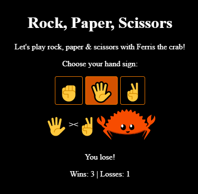

# Rock, Paper & Scissors

A game written in Rust WebAssembly with some HTML as the display.



## How to Start

This project requires Rust, PowerShell & `wasm-bindgen-cli` installed on your system.

```
cargo install -f wasm-bindgen-cli
```

Run the build script:

``` powershell
.\build
```

Then use any HTTP server of your choice.

### Node.js
``` powershell
npm install http-server -g
http-server
```

### Python 3
``` powershell
python -m http.server
```
